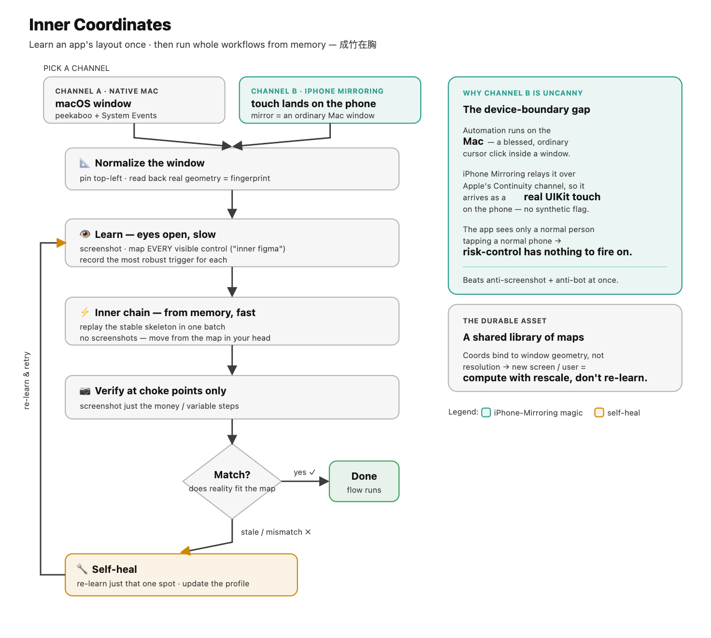
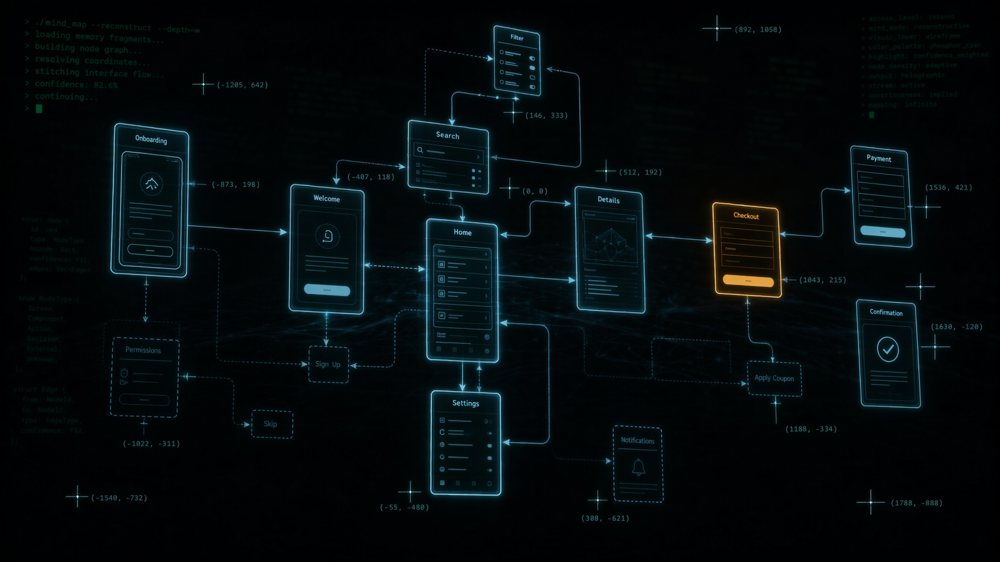

# Inner Coordinates · 内心的坐标

> Reverse-engineer a clickable map of any macOS or iPhone app **from the outside**, store it, and replay whole workflows **from memory** — learn once, then execute without screenshotting every step.



**Inner Coordinates** is a [Claude Code](https://claude.com/claude-code) skill (plus a small set of standalone shell tools) for reliable **GUI automation of macOS native apps and iOS apps** (through **iPhone Mirroring**) — *including* apps that expose **no accessibility tree** and actively **resist screenshots and automation** (WeChat / 微信, Meituan / 美团, and friends).

Think of it as **Figma in reverse**: instead of designing a UI, you recover a *coordinate map* of an existing one, save it as a reusable **profile**, and let an AI agent click through it. Coordinates are disposable and drift over time — the durable asset is the **learn → verify → self-heal loop** and the growing **library of maps** that anyone can share and reuse.

Keywords: macOS GUI automation, iPhone Mirroring automation, Claude Code skill, control apps without an Accessibility API, automate WeChat, automate a Meituan food order, AppleScript / System Events automation, peekaboo, cliclick, AI agent computer use, coordinate map / UI map, desktop automation.

---

## Why this exists

Standard UI automation reads an app's **accessibility tree** to find elements. Many real-world apps either don't expose one, render content that screenshots come back **blank** for, or run **anti-automation / risk-control** that logs you out. For those, querying the UI fails.

Inner Coordinates takes the opposite approach — it **rebuilds the interaction map from the outside**:

1. **Learn once (eyes open, slow):** normalize the window to a fixed rectangle, screenshot, and record where every visible control is — *plus the controls you didn't click this time* (the "inner figma" principle). Note the most robust way to trigger each one (keyboard shortcut > menu > a11y > cached coordinate).
2. **Run from memory (the inner chain, fast):** once a flow is learned, execute the stable skeleton in one go from the recorded coordinates. **Screenshot only at choke points** — a content-dependent step the map can't predict, or a money/irreversible final tap.
3. **Self-heal:** any verification miss = the map is stale → re-learn that one spot → update the profile.

The point is *not* "click blindly." You've got the map in your head — you move with **成竹在胸 (a fully-formed plan in mind)**, looking only where the layout genuinely varies.

## Why this is remarkable — the device-boundary gap

The iPhone Mirroring channel does something subtle and, frankly, a little uncanny: **it makes app-side risk-control blind — not by defeating it, but by stepping around the device boundary that all of it depends on.**

App anti-automation defenses run *on the device the app runs on*. On iOS they look for the tell-tale signs of automation **on that phone**: synthetic or injected touch events, an attached automation framework (XCTest, accessibility-driven control), a jailbreak tweak, a debugger, screen recording. See any of those → refuse, or log you out.

With iPhone Mirroring, **none of those signals exist on the phone**, because the automation isn't happening on the phone:

- The agent drives an **ordinary macOS window** — `peekaboo` / `cliclick` just move a cursor and click inside the mirror window. Fully sanctioned Mac automation; Apple blesses it.
- iPhone Mirroring **relays that input to the phone over Apple's own Continuity channel**, where it arrives as a **genuine UIKit touch from the device's real input stack** — indistinguishable from your thumb. No third-party framework is injected into the app's process; the touch carries no synthetic-event flag; no accessibility automation runs on the phone.
- So the app sees exactly one thing: **a normal person tapping a normal phone.** Its risk-control has nothing to fire on — because, from its point of view, *nothing unusual happened on its machine.*

The screenshot side mirrors this: an iOS app's on-device screenshot/secure-flag protections can't stop you reading the **Mac window** displaying it — that's a different machine's screen buffer entirely. (Where a hardened app still blanks even the mirror, you reconstruct coordinates from a fixed window geometry instead.)

The deep reason it works: **the Mac and the phone are not the same machine.** Every defense the app has is scoped to *its* device. By splitting the operation across the device boundary — legitimate automation on one machine, legitimate human-grade input arriving on the other, joined by *Apple's own bridge* — you chain two individually-blessed surfaces into an end-to-end path that **no single device can see as automated.** It isn't an exploit of any one component; it's an emergent gap in the **seam between two of Apple's own features** — a *pseudo-bug of the system as a whole.*

## The ceiling — where this goes

Push the idea to its limit. Every app you teach adds a permanent, shareable map. As the library fills in, an agent holding these maps can **chain inner coordinates across every app you use** and run your routine digital life at machine speed — order the food, send the message, book the table, pay the bill, refill the prescription — one continuous inner chain, pausing only where reality actually varies.

Taken all the way, a sufficiently complete library means the agent can stand in for **your manual internet interaction itself.** The tapping, typing, and waiting that fills your day becomes something it does, in seconds, on your behalf. That is the upper bound of this skill: you talk, and your apps just *happen*.

*(Same power, same responsibility — run it on your own accounts and devices, for your own tasks.)*



> *The inner chain, the way the agent holds it: screens it has already learned glow crisp and confident; everything else stays a faint dotted outline until it learns it. Every node carries its coordinates. This is what "成竹在胸" looks like from the inside.*

## Two channels (the skill picks, you confirm)

- **(A) Native macOS windows** — `peekaboo` + AppleScript `System Events`. Fast, no mirror lag. For apps with a working, screenshotable, automatable Mac version (e.g. 网易云音乐 / NetEase Music).
- **(B) iOS apps via iPhone Mirroring** — the action happens **on the phone** (one normal touch, no Mac-side risk control), while the mirror window is an **ordinary macOS window** you can `screencapture` and `peekaboo click`. This bypasses **both** anti-screenshot *and* anti-automation defenses at once. Proven end-to-end on **WeChat** and **Meituan**.

When both are viable, the skill gives a recommendation and asks you which channel to use.

## How it works (the loop)

```
normalize window (pin top-left, read back actual geometry = fingerprint)
        │
   learn (eyes open) ── screenshot ── record every visible control (inner figma)
        │                              + most robust trigger per control
        ▼
   inner chain (from memory) ── run stable skeleton in one batch, no screenshots
        │                       screenshot ONLY at choke points
        ▼
   verify each result ── mismatch? ── self-heal: re-learn that spot, update profile
```

**Window convention:** the window is always **pinned to the top-left** (`set position {0,25}`, then read back the *actual* geometry — menu-bar / notch height is absorbed automatically). This shared convention is what makes coordinates **transferable between users and machines**.

## Quick start

Requirements: macOS, [Homebrew](https://brew.sh), and an agent that can run shell + read screenshots (e.g. Claude Code). `setup.sh` installs the rest — [`peekaboo`](https://github.com/steipete/peekaboo) (clicks/swipes), [`cliclick`](https://github.com/BlueM/cliclick) (real modified-key paste), and Pillow (grid tool) — all via Homebrew/pip, nothing to download by hand. For the iPhone Mirroring channel: iPhone Mirroring set up **and Handoff / Universal Clipboard turned ON**.

```bash
git clone https://github.com/XiaoChu-1208/inner-coordinates.git
cd inner-coordinates
./setup.sh                      # auto-installs cliclick + peekaboo (brew) + Pillow (pip)

# Use as a Claude Code skill:
ln -s "$PWD" ~/.claude/skills/inner-coordinates
# …then just ask your agent: "open NetEase Music and play <song>" /
#                            "order me a latte on Meituan"

# Or use the tools standalone:
lib/normalize.sh "iPhone Mirroring"          # pin + fingerprint a window
lib/grab-grid.sh "iPhone Mirroring" /tmp/g.png 50   # screenshot with a coordinate grid
lib/rescale.sh  "iPhone Mirroring" 145 356   # map a learned coord to the current window
```

Grant your terminal/agent **Screen Recording** + **Accessibility** in System Settings → Privacy & Security.

## Supported apps & operations

| App | Channel | Operations (tested) |
|-----|---------|---------------------|
| 网易云音乐 NetEase Music | A · native | search & play, play/pause / next / prev / volume (via menu), liked songs, recent, sidebar nav |
| 微信 WeChat | B · iPhone Mirroring | search a contact and send a Chinese message, stickers (full auto: clipboard + real Cmd+V via cliclick, send via Return) |
| 美团外卖 Meituan | B · iPhone Mirroring | **full order → payment**: search store, enter store, pick spec (less ice / hot / less espresso), add to cart, top up to min-order, delete cart items, checkout, apply coupon, choose Alipay, enter pay password digit-by-digit. Real order placed end-to-end. |

See [`profiles/`](profiles/) for each map and `profiles/_index.json` for the catalogue. Want more? **[Contribute yours »](CONTRIBUTING.md)**

## Coordinates are portable (different screen size / window / user)

Coordinates bind to **window geometry, not Mac resolution.** `normalize` pins the window; `lib/rescale.sh` converts any learned coordinate to your current window by simple proportional scaling (the window keeps a fixed aspect ratio, so one factor does it):

```
fx = (x - refX) / refW            # learned coord → fraction of window (0–1)
fy = (y - refY) / refH
click = (curX + fx·curW, curY + fy·curH)   # fraction → your window's absolute coord
```

So a different resolution (1920×1080, external 4K…), a resized mirror window, or **another user's machine** = **compute, don't re-learn.**

**iPhone model compatibility** (iPhone Mirroring profiles were learned on **iPhone 14 Plus**, 428×926 pt):

- **Drop-in identical layout:** iPhone 12 Pro Max, 13 Pro Max (also 428×926).
- **~99% (same 19.5:9, 430×932 Dynamic Island — verify the top status/island area):** 14 Pro Max, 15 Plus, 15 Pro Max, 16 Plus.
- **Edge-anchored controls transfer, content reflows (verify):** 6.1″/6.3″ models (390×844, 393×852, 402×874).
- **Re-learn:** old aspect ratios (home-button phones 375×667 / 414×736).

## Use it hands-free with Claude Baby

Pair Inner Coordinates with **[Claude Baby](https://github.com/XiaoChu-1208/claude-baby)** — a voice-driven desktop-pet that runs Claude Code as its brain. Say *"order me a latte"* out loud and Claude Baby invokes this skill and runs the inner chain on your phone via iPhone Mirroring. Talk to your computer, it operates your apps. (Claude Baby builds on [clawd-on-desk](https://github.com/XiaoChu-1208/clawd-on-desk).) The two together work great.

## Pro tip: give it its own machine (only half joking)

The best setup is a **dedicated Mac for Inner Coordinates** — a little always-on automation appliance — so it runs your errands in the background without fighting you for the cursor while you (or Claude) actually use your main computer.

And one step further: give Claude **its own phone *and* its own Mac.** A dedicated iPhone mirrored to a dedicated Mac, doing nothing but being your hands on the internet. At that point it isn't borrowing your devices — it *has* its own, sitting in the corner, quietly getting your digital chores done. (We did say half joking.)

## Learning new apps

See **[docs/LEARNING.md](docs/LEARNING.md)** — when to learn, how to guide a learning pass, the inner-figma principle (record the whole screen while you're there), and the inner-chain execution discipline (learn well once, then carry it through without wasting time re-screenshotting).

## Contributing your inner coordinates

This library gets better the more maps it holds. **PRs of new app profiles are welcome** — see **[CONTRIBUTING.md](CONTRIBUTING.md)**. Golden rule: **de-identify** — never commit passwords, phone numbers, addresses, names, or account IDs; use placeholders.

## Privacy & safety

- Profiles, scripts, and the repo store **coordinates and flows only** — never secrets. A payment password is **never** written to any file.
- **Hands-free payment is opt-in.** By default the agent stops at the keypad and asks you for the password (entered digit-by-digit, never stored). If you want it fully unattended, *arm* it once by putting your password in the local macOS Keychain:
  ```bash
  security add-generic-password -a meituan -s ic-alipay-pay -w   # prompts; stored encrypted, local only
  ```
  Then `lib/pay-keypad.sh` reads it from the Keychain and types it on the keypad — the password lives only in your encrypted Keychain, never in the repo. Even when armed, the agent **asks before auto-paying** ("pay with the keychain password?") and screenshots the order/amount to self-verify first — unattended, but not blind. Entering 6 digits auto-submits, so it only runs at a real keypad on a verified order.
- For money / irreversible actions the agent **verifies with a screenshot** (looks, doesn't nag) and proceeds when you've clearly asked for the result.
- Everything runs locally on your Mac; nothing is sent anywhere by this project.
- **Forking or sending a PR? De-identify first.** The moment a profile leaves your machine, it must be clean — scrub passwords, phone numbers, addresses, names, account IDs, contact handles. Use placeholders (`<address, redacted>`). See [CONTRIBUTING.md](CONTRIBUTING.md).

## License

MIT — see [LICENSE](LICENSE).

---

## 中文简介

**Inner Coordinates（内心的坐标）** 是一个 [Claude Code](https://claude.com/claude-code) 技能 + 一套 shell 工具，用来可靠地操控 **macOS 原生 App 和 iOS App（经 iPhone 镜像）**——包括那些**不暴露可访问性树、还防截屏/反自动化**的 App（微信、美团…）。

思路是「**反向 Figma**」：不设计界面，而是**从外部反向重建一张界面坐标图**，存成可复用的 `profile`，让 AI 照着点。坐标会过期，真正的资产是这套**会学、会验、会自愈**的回路，以及越攒越大、人人可共享的坐标库。

- **学一次（睁眼，慢）**：归一化窗口 → 截图 → 把这一屏**所有可见控件**的位置都记下（连没点的也记，「内心 figma」）。
- **跑内心链路（凭记忆，快）**：学好后，稳定骨架一口气连点不截图；**只在卡点截图**（算不出的内容相关步、或花钱的临门一脚）。
- **自愈**：任一验证不符 = 地图过期 → 只重学那一处 → 更新 profile。

两条渠道：**(A) 直接操控 Mac 原生窗口**；**(B) 经 iPhone 镜像操控 iOS App**。技能会判断走哪条，两条都行时让你拍板。

坐标只跟**窗口几何**绑定、不跟分辨率绑定——换屏/换窗口大小/换用户都用 `lib/rescale.sh` **算出来，不用重学**。窗口统一**贴左上角归一化**，这是跨用户复用坐标的前提。

搭配语音桌宠 **[Claude Baby](https://github.com/XiaoChu-1208/claude-baby)** 用：对它说「帮我点杯拿铁」，它就调用本技能、在 iPhone 镜像里把内心链路跑完。

欢迎大家贡献自己学到的「内心的坐标」→ 见 [CONTRIBUTING.md](CONTRIBUTING.md)。
